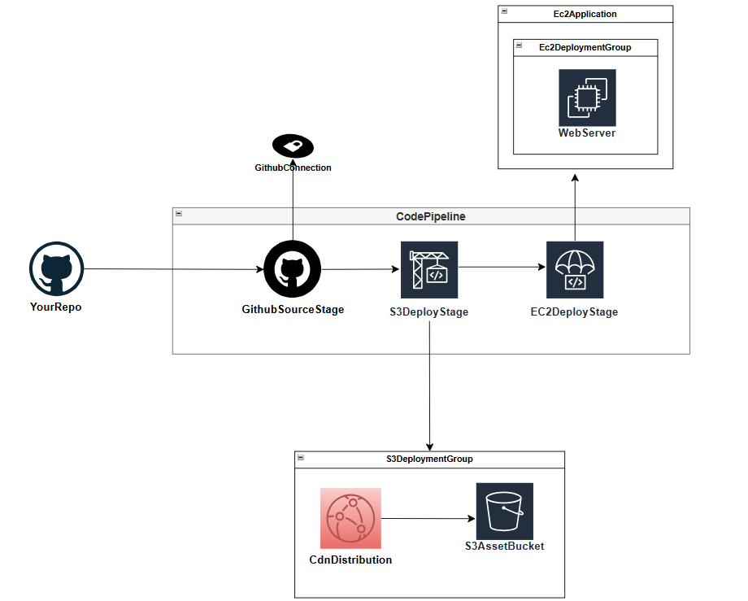

# CI/CD Pipeline - Builders Day Lab (Console Edition)
**AWS Certified Cloud Practitioner / Associate Level**  
Learn CI/CD by building an automated deployment pipeline using CodePipeline, CodeBuild, and CodeDeploy - all through the AWS Management Console.

---

## Lab Overview
Build a complete CI/CD pipeline that:
1. **Sources code** from your forked GitHub repository
2. **Builds and deploys** static assets to S3 via CodeBuild
3. **Deploys application** to EC2 via CodeDeploy
4. **Distributes content** globally via CloudFront CDN

**Architecture Flow:**
- GitHub → CodePipeline → CodeBuild (S3 Deploy) → CodeDeploy (EC2 Deploy)



---

## Prerequisites
- AWS account with Administrator access
- **Web browser** with access to AWS Management Console
- GitHub account (we'll create one if needed)
- **Region**: All tasks must be done in **us-west-2** for consistency

---

## Architecture & Components
We'll build a pipeline with:
- ✅ **GitHub source integration** with webhook triggers
- ✅ **CodeBuild stage** for S3 static asset deployment
- ✅ **CodeDeploy stage** for EC2 application deployment
- ✅ **Proper IAM roles** with required permissions
- ✅ **EC2 with CodeDeploy agent** pre-configured

---

## Getting Started: AWS Management Console

### Step 0: Region Selection & GitHub Setup
1. **Sign in** to AWS Management Console at [https://console.aws.amazon.com](https://console.aws.amazon.com)
2. **Select region**: **us-west-2** (Oregon) in the top-right corner
3. **GitHub Setup**:
   - Create GitHub account at [https://github.com](https://github.com) (if you don't have one)
   - Navigate to [https://github.com/buildwithbrainyl/ccp](https://github.com/buildwithbrainyl/ccp)
   - **Click "Fork"** to create your own copy of the repository
   - **Note your fork URL** (e.g., `https://github.com/yourusername/ccp`)


---

## Part 1: Prerequisites Setup

### Step 1: Create Required IAM Roles

#### CodeDeploy Service Role
1. **Navigate** to IAM service in AWS Console
2. **Click** "Roles" → "Create role"
3. **Select** "AWS service" → "CodeDeploy" → "CodeDeploy"
4. **Click "Next"** (AWSCodeDeployRole policy auto-attached)
5. **Role name**: `CodeDeployServiceRole`
6. **Click "Create role"**

#### EC2 Instance Role for CodeDeploy
1. **Click** "Create role" again
2. **Select** "AWS service" → "EC2"
3. **Click "Next"** → **Attach policies**:
   - Search and select `AmazonEC2RoleforAWSCodeDeploy`
   - Search and select `CloudWatchAgentServerPolicy`
4. **Role name**: `EC2CodeDeployRole`
5. **Click "Create role"**

### Step 2: Launch EC2 Instance with CodeDeploy Agent
1. **Navigate** to EC2 service → **Click "Launch Instance"**
2. **Configuration**:
   - **Name**: `WebServer-CodeDeploy`
   - **AMI**: Amazon Linux 2023 AMI
   - **Instance type**: t2.micro (Free Tier)
   - **Key pair**: Create new or use existing
   - **Security group**: Create new with HTTP (80) and SSH (22) access
   - **IAM instance profile**: Select `EC2CodeDeployRole`

3. **Advanced Details** → **User data** (copy/paste):
```bash
#!/bin/bash
sudo dnf -y update
sudo dnf -y install ruby
sudo dnf -y install wget
sudo dnf -y install httpd
cd /home/ec2-user
wget https://aws-codedeploy-us-west-2.s3.us-west-2.amazonaws.com/latest/install
sudo chmod +x ./install
sudo ./install auto
```

4. **Click "Launch instance"**
5. **Wait** for instance to reach "Running" state
6. **Note the Instance ID** for later use

### Step 3: Create CodeDeploy Application
1. **Navigate** to CodeDeploy service
2. **Click** "Create application"
3. **Application name**: `WebApp-Deploy`
4. **Compute platform**: EC2/On-premises
5. **Click "Create application"**

### Step 4: Create Deployment Group
1. **Click** "Create deployment group"
2. **Configuration**:
   - **Deployment group name**: `WebApp-DeploymentGroup`
   - **Service role**: Select `CodeDeployServiceRole`
   - **Deployment type**: In-place
   - **Environment configuration**: Amazon EC2 instances
   - **Key**: Name, **Value**: `WebServer-CodeDeploy`
   - **Load balancer**: Disable
3. **Click "Create deployment group"**

---

## Part 2: Prerequisites - S3 & CloudFront Setup

> **📋 Note**: This section abstracts the S3 and CloudFront setup as covered in previous labs. You need:
> - An **empty S3 bucket** for static assets
> - A **CloudFront distribution** with the S3 bucket as origin
> 
> **Required Information in later sections**:
> - S3 bucket name (e.g., `my-static-assets-bucket-unique-name`)
> - CloudFront distribution ID (e.g., `E1234567890ABC`)

---

## Part 3: Create CodeBuild Project

### Step 1: Navigate to CodeBuild
1. **Navigate** to CodeBuild service
2. **Click** "Create build project"

### Step 2: Configure Build Project
**Project configuration:**
- **Project name**: `S3-Deploy-Build`
- **Description**: `Build project to deploy static assets to S3`

**Source:**
- **Source provider**: GitHub
- **Repository**: Connect using OAuth (follow prompts to authorize)
- **GitHub repository**: Select your forked `ccp` repository
- **Source version**: `main`

**Environment:**
- **Environment image**: Managed image
- **Operating system**: Amazon Linux 2
- **Runtime**: Standard
- **Image**: aws/codebuild/amazonlinux2-x86_64-standard:3.0
- **Service role**: Create new service role (accept default name)

**Buildspec:**
- **Build specifications**: Use a buildspec file
- **Buildspec name**: `builders-day/s3/demo_s3/buildspec.yml`

### Step 3: Configure Environment Variables
**Environment variables:**
- **Name**: `S3_BUCKET`, **Value**: `your-s3-bucket-name`
- **Name**: `CLOUDFRONT_DISTRIBUTION_ID`, **Value**: `your-cloudfront-distribution-id`

### Step 4: Create Build Project
1. **Click "Create build project"**
2. **Wait** for creation to complete

### Step 5: Modify CodeBuild Service Role
1. **Navigate** to IAM → **Roles**
2. **Find** the CodeBuild service role (e.g., `codebuild-S3-Deploy-Build-service-role`)
3. **Click** on the role → **Attach policies**
4. **Add these policies**:
   - `AmazonS3FullAccess`
   - `CloudFrontFullAccess`
5. **Click "Attach policies"**

---

## Part 4: Create CodePipeline

### Step 1: Navigate to CodePipeline
1. **Navigate** to CodePipeline service
2. **Click** "Create pipeline"

### Step 2: Pipeline Settings
- **Pipeline name**: `WebApp-CI-CD-Pipeline`
- **Service role**: Create new service role
- **Artifact store**: Default location (S3)
- **Click "Next"**

### Step 3: Add Source Stage
- **Source provider**: GitHub (Version 2)
- **Connection**: Create new connection
  - **Connection name**: `GitHub-Connection`
  - **Follow OAuth flow** to authorize GitHub access
- **Repository name**: Select your forked `ccp` repository
- **Branch name**: `main`
- **Output artifacts**: `SourceOutput`
- **Click "Next"**

### Step 4: Add Build Stage
- **Build provider**: AWS CodeBuild
- **Project name**: Select `S3-Deploy-Build`
- **Input artifacts**: `SourceOutput`
- **Output artifacts**: `BuildOutput`
- **Click "Next"**

### Step 5: Add Deploy Stage
- **Deploy provider**: AWS CodeDeploy
- **Application name**: `WebApp-Deploy`
- **Deployment group**: `WebApp-DeploymentGroup`
- **Input artifacts**: `SourceOutput`
- **Click "Next"**

### Step 6: Review and Create
1. **Review** all configuration
2. **Click "Create pipeline"**

### Step 7: Modify CodePipeline Service Role
1. **Navigate** to IAM → **Roles**
2. **Find** the CodePipeline service role (e.g., `AWSCodePipelineServiceRole-us-west-2-WebApp-CI-CD-Pipeline`)
3. **Click** on the role → **Attach policies**
4. **Add these policies**:
   - `AWSCodeBuildDeveloperAccess`
   - `AWSCodeDeployFullAccess`
5. **Click "Attach policies"**

---

## Part 5: Test the Pipeline

### Step 1: Monitor Pipeline Execution
1. **Navigate** to CodePipeline service
2. **Click** on `WebApp-CI-CD-Pipeline`
3. **Watch** the pipeline execution:
   - ✅ **Source stage**: Pulls from GitHub
   - ✅ **Build stage**: Runs CodeBuild project
   - ✅ **Deploy stage**: Deploys to EC2 via CodeDeploy

### Step 2: Verify S3 Deployment
1. **Navigate** to S3 service
2. **Open** your static assets bucket
3. **Verify** files were deployed by CodeBuild stage
4. **Navigate** to CloudFront service
5. **Open** your distribution
6. **Copy** the CloudFront domain name (e.g., `d1234567890abc.cloudfront.net`)
7. **Open** in browser to verify content is served via CDN

### Step 3: Verify EC2 Deployment
1. **Navigate** to EC2 service
2. **Find** your `WebServer-CodeDeploy` instance
3. **Copy** the public IP address
4. **Open** in browser: `http://your-ec2-public-ip`
5. **Verify** the application is running

### Step 4: Test Automated Deployment
1. **Navigate** to your GitHub fork
2. **Make a simple change** to any file in the repository
3. **Commit** the change to the `main` branch
4. **Return** to CodePipeline console
5. **Watch** the pipeline automatically trigger and execute

---

## Part 6: Monitoring and Troubleshooting

### CloudWatch Logs
1. **Navigate** to CloudWatch → **Log groups**
2. **Find** logs for:
   - `/aws/codebuild/S3-Deploy-Build`
   - `/aws/codedeploy/WebApp-Deploy`

### Common Issues and Solutions

**CodeBuild Fails:**
- ✅ Check buildspec path: `builders-day/s3/demo_s3/buildspec.yml`
- ✅ Verify environment variables are set correctly
- ✅ Ensure CodeBuild role has S3 and CloudFront permissions

**CodeDeploy Fails:**
- ✅ Verify EC2 instance has `EC2CodeDeployRole` attached
- ✅ Check CodeDeploy agent is running on EC2
- ✅ Ensure `appspec.yml` is in repository root
- ✅ Verify CodeDeploy service role permissions
- ✅ SSH to EC2 and check agent logs: `/var/log/aws/codedeploy-agent/codedeploy-agent.log`

**Pipeline Permission Errors:**
- ✅ CodePipeline role needs CodeBuild and CodeDeploy access
- ✅ Use full access policies for testing environments

---

## Architecture Review

### Pipeline Flow
1. **Developer** pushes code to GitHub
2. **GitHub webhook** triggers CodePipeline
3. **Source stage** pulls latest code
4. **Build stage** (CodeBuild):
   - Builds static assets
   - Deploys to S3 bucket
   - Invalidates CloudFront cache
5. **Deploy stage** (CodeDeploy):
   - Deploys application to EC2
   - Uses `appspec.yml` for deployment instructions

### Key Components
- **CodePipeline**: Orchestrates the entire workflow
- **CodeBuild**: Handles build and S3 deployment
- **CodeDeploy**: Manages EC2 application deployment
- **IAM Roles**: Provide necessary permissions
- **GitHub**: Source code repository with webhook integration

---

## Cleanup

### Delete Pipeline Resources
1. **CodePipeline**: Delete `WebApp-CI-CD-Pipeline`
2. **CodeBuild**: Delete `S3-Deploy-Build` project
3. **CodeDeploy**: Delete deployment group and application
4. **EC2**: Terminate `WebServer-CodeDeploy` instance
5. **IAM**: Delete created roles (optional)
6. **S3**: Empty and delete artifact bucket (optional)

### Verify Cleanup
1. **Check** all services for remaining resources
2. **Review** billing dashboard for any ongoing charges

---

## Key Takeaways

### CI/CD Benefits
- **Automation**: Reduces manual deployment errors
- **Consistency**: Same process for every deployment
- **Speed**: Faster time to production
- **Reliability**: Automated testing and rollback capabilities

### AWS DevOps Services
- **CodePipeline**: Workflow orchestration
- **CodeBuild**: Managed build service
- **CodeDeploy**: Automated deployment service
- **Integration**: Seamless GitHub integration with webhooks

### Best Practices Demonstrated
- ✅ **IAM roles** with least privilege principles
- ✅ **Environment variables** for configuration management
- ✅ **Artifact management** between pipeline stages
- ✅ **Monitoring** with CloudWatch integration

---

## Resources
- [AWS CodePipeline Documentation](https://docs.aws.amazon.com/codepipeline/)
- [AWS CodeBuild User Guide](https://docs.aws.amazon.com/codebuild/)
- [AWS CodeDeploy User Guide](https://docs.aws.amazon.com/codedeploy/)
- [GitHub Repository](https://github.com/buildwithbrainyl/ccp)

---

**🎯 Learning Objectives Achieved:**
- ✅ Understand CI/CD pipeline concepts
- ✅ Configure automated GitHub integration
- ✅ Deploy to multiple targets (S3 and EC2)
- ✅ Implement proper IAM security practices
- ✅ Monitor and troubleshoot pipeline execution
